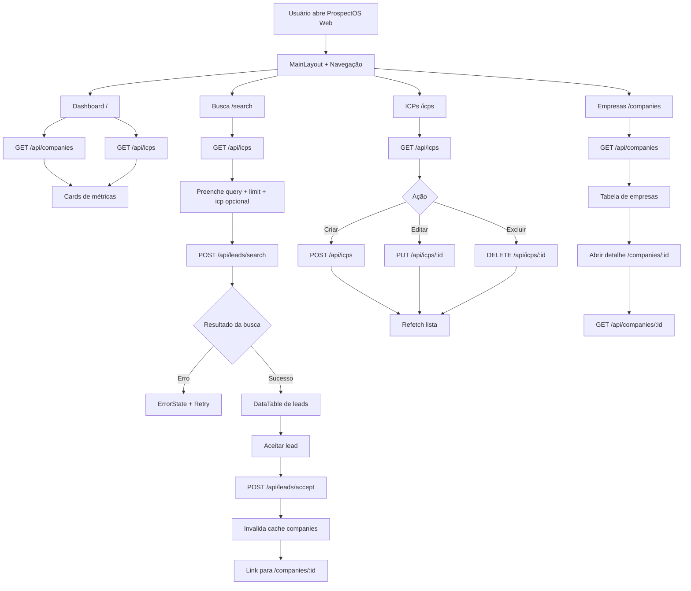
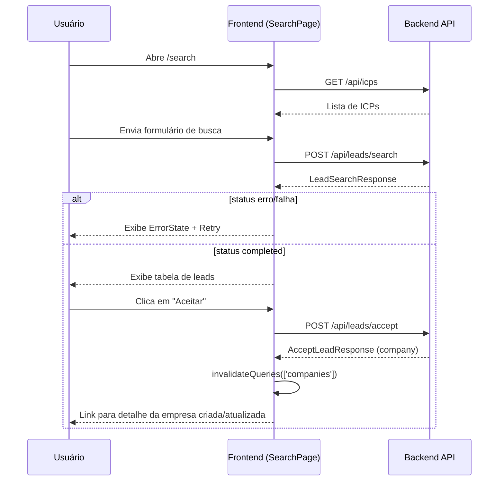

# Fluxograma de Uso do Aplicativo (Estado Atual)

Data de referência: 2026-03-14

## 1) Jornada principal do usuário

## 2) Fluxo detalhado de busca e aceite

## Observações práticas do estado atual

- IDs de `Company` e `ICP` no frontend são tratados como string para evitar problemas de precisão no JavaScript.
- Na camada backend, o `externalId` foi ajustado para política de faixa segura JS e normalização em `development`.
- Em caso de falha de carregamento ou mutação, as páginas usam `ErrorState` com ação de tentativa (`Retry`) quando aplicável.
