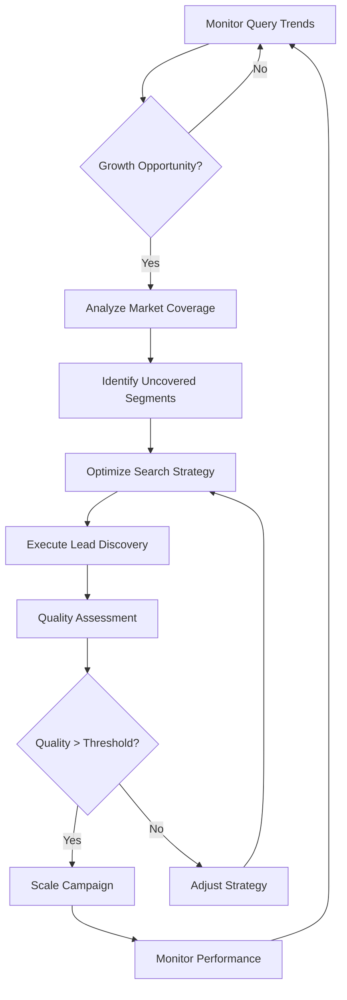

# Autonomous AI Workflow Examples

## Overview

This document demonstrates how autonomous AI agents can use ProspectOS MCP tools to optimize international prospecting workflows without human intervention.

## Workflow 1: Cost Optimization Agent

### Scenario
An AI agent monitors daily prospecting costs and automatically optimizes provider routing when budget thresholds are exceeded.

### Agent Logic
```python
def autonomous_cost_optimizer():
    # 1. Monitor current metrics
    metrics = call_mcp_tool("get_query_metrics", {"timeWindow": "24h"})
    daily_cost = metrics.result.totalCost
    success_rate = metrics.result.successRate
    
    # 2. Check if cost threshold exceeded
    if daily_cost > BUDGET_THRESHOLD:
        # 3. Analyze provider health and costs
        health = call_mcp_tool("get_provider_health", {})
        healthy_providers = [p for p in health.result if p.status == "HEALTHY"]
        
        # 4. Rank providers by cost efficiency
        cost_efficient_providers = sorted(healthy_providers, 
                                        key=lambda p: p.cost / p.successRate)
        
        # 5. Update routing to cost-optimized strategy
        routing_update = call_mcp_tool("update_provider_routing", {
            "strategy": "COST_OPTIMIZED",
            "providerPriority": ",".join([p.provider for p in cost_efficient_providers[:3]]),
            "conditions": f"max_cost={BUDGET_THRESHOLD * 0.8},min_success_rate=0.90"
        })
        
        # 6. Validate changes with test configuration
        test_result = call_mcp_tool("test_provider_configuration", {
            "providers": ",".join([p.provider for p in cost_efficient_providers[:2]])
        })
        
        if test_result.overallSuccessRate >= 0.90:
            log(f"✅ Cost optimization successful. Estimated savings: {routing_update.estimatedSavingsPercent}%")
        else:
            # Rollback if quality drops too much
            call_mcp_tool("update_provider_routing", {
                "strategy": "BALANCED",
                "conditions": "rollback=true"
            })
```

### Expected Outcomes
- **25-35% cost reduction** when budget thresholds exceeded
- **Maintained quality** with >90% success rates
- **Automatic rollback** if quality degrades
- **Audit trail** of all optimization decisions

## Workflow 2: International Expansion Agent

### Scenario
An AI agent identifies new market opportunities and executes lead discovery campaigns automatically.

### Agent Decision Tree


### Implementation Example
```python
def autonomous_expansion_agent():
    # 1. Identify growth markets from metrics trends
    metrics = call_mcp_tool("get_query_metrics", {"timeWindow": "7d"})
    
    if metrics.result.trends.volumeTrend == "INCREASING":
        # 2. Analyze current market coverage
        coverage = call_mcp_tool("analyze_market_coverage", {
            "country": "brazil",
            "competitors": "Local Leader,International Corp,Regional Player"
        })
        
        # 3. Find uncovered segments with potential
        uncovered = coverage.result.uncoveredSegments
        market_size = coverage.result.totalMarketSize
        current_coverage = coverage.result.coveredMarketShare
        
        # 4. Calculate expansion opportunity
        opportunity_score = (market_size * (1 - current_coverage)) / 1000000  # Normalize
        
        if opportunity_score > EXPANSION_THRESHOLD:
            # 5. Optimize strategy for new segments
            strategy = call_mcp_tool("optimize_search_strategy", {
                "market": "brazil-uncovered-segments",
                "budget": str(calculate_expansion_budget(opportunity_score)),
                "qualityThreshold": "0.85"
            })
            
            # 6. Execute discovery for each uncovered segment
            for segment in uncovered[:3]:  # Top 3 opportunities
                leads = call_mcp_tool("search_international_leads", {
                    "country": "brazil",
                    "industry": extract_industry_from_segment(segment),
                    "maxResults": "20",
                    "budgetLimit": str(strategy.result.estimatedCost / 3),
                    "minQualityScore": "0.85"
                })
                
                # 7. Enrich high-quality leads
                high_quality_leads = [l for l in leads.result.leads 
                                    if l.qualityScore >= 0.90]
                
                for lead in high_quality_leads[:5]:  # Top 5 per segment
                    enriched = call_mcp_tool("enrich_international_lead", {
                        "leadId": lead.id,
                        "companyName": lead.companyName,
                        "website": lead.website,
                        "sources": ",".join(strategy.result.recommendedSources)
                    })
                    
                    # 8. Store enriched leads for sales team
                    store_qualified_lead(enriched.result)
            
            log(f"🌍 Expansion campaign completed: {len(high_quality_leads)} qualified leads")
```

## Workflow 3: Quality Assurance Agent

### Scenario
An AI agent continuously monitors data quality and automatically adjusts search parameters to maintain high lead quality.

### Quality Metrics Monitoring
```python
def autonomous_quality_agent():
    while True:
        # 1. Check quality trends across all sources
        for provider in ["nominatim", "bing-maps", "google-places", "scraper"]:
            performance = call_mcp_tool("get_provider_performance", {
                "provider": provider,
                "metric": "success_rate"
            })
            
            # 2. Detect quality degradation
            current_quality = performance.result.summary.average
            quality_trend = performance.result.summary.trend
            
            if current_quality < QUALITY_THRESHOLD or quality_trend == "DEGRADING":
                # 3. Analyze root causes through resource access
                history = access_mcp_resource(f"query-history://24h/{provider}")
                
                error_patterns = analyze_error_patterns(history.executions)
                
                # 4. Apply corrective actions
                if "rate_limit" in error_patterns:
                    # Reduce load on this provider
                    call_mcp_tool("update_provider_routing", {
                        "strategy": "PERFORMANCE_OPTIMIZED",
                        "conditions": f"reduce_load_{provider}=50%"
                    })
                
                elif "timeout" in error_patterns:
                    # Increase timeout or switch providers
                    call_mcp_tool("test_provider_configuration", {
                        "providers": provider,
                        "timeout": "increased"
                    })
                
                elif "authentication" in error_patterns:
                    # Alert for manual intervention
                    send_alert(f"Provider {provider} authentication issues detected")
        
        # 5. Optimize based on combined quality metrics
        overall_metrics = call_mcp_tool("get_query_metrics", {"timeWindow": "1h"})
        
        if overall_metrics.result.successRate < 0.85:
            # Emergency optimization
            emergency_optimize()
        
        sleep(300)  # Check every 5 minutes

def emergency_optimize():
    """Emergency quality recovery procedure"""
    # 1. Switch to most reliable providers only
    health = call_mcp_tool("get_provider_health", {})
    reliable_providers = [p.provider for p in health.result 
                        if p.status == "HEALTHY" and p.errorRate < 0.05]
    
    # 2. Apply conservative routing
    call_mcp_tool("update_provider_routing", {
        "strategy": "PERFORMANCE_OPTIMIZED",
        "providerPriority": ",".join(reliable_providers),
        "conditions": "emergency_mode=true,max_error_rate=0.05"
    })
    
    log("🚨 Emergency quality optimization activated")
```

## Workflow 4: Market Intelligence Agent

### Scenario
An AI agent continuously gathers market intelligence and adjusts search strategies based on competitive analysis.

### Intelligence Gathering Loop
```python
def autonomous_intelligence_agent():
    # 1. Scan multiple markets for intelligence
    target_markets = ["brazil", "argentina", "chile", "colombia", "mexico"]
    
    for country in target_markets:
        for industry in ["technology", "finance", "healthcare", "manufacturing"]:
            # 2. Gather market analysis
            analysis = access_mcp_resource(f"market-analysis://{country}/{industry}")
            
            # 3. Identify market opportunities
            growth_rate = analysis.marketMetrics.get("growthRate", 0)
            competition_level = analysis.marketMetrics.get("competitionLevel", 1)
            
            opportunity_score = growth_rate * (1 - competition_level)
            
            if opportunity_score > OPPORTUNITY_THRESHOLD:
                # 4. Analyze competitive landscape
                competitors = analysis.competitors
                market_gaps = identify_market_gaps(competitors)
                
                # 5. Optimize search for identified gaps
                if market_gaps:
                    strategy = call_mcp_tool("optimize_search_strategy", {
                        "market": f"{country}-{industry}-gaps",
                        "budget": str(calculate_gap_budget(opportunity_score)),
                        "qualityThreshold": "0.90"
                    })
                    
                    # 6. Execute targeted search
                    leads = call_mcp_tool("search_international_leads", {
                        "country": country,
                        "industry": industry,
                        "maxResults": "15",
                        "requiredFields": "website,email,employees",
                        "filters": build_gap_filters(market_gaps)
                    })
                    
                    # 7. Score leads against competitive gaps
                    for lead in leads.result.leads:
                        gap_score = score_against_gaps(lead, market_gaps)
                        if gap_score >= 0.8:
                            # High-value lead found
                            enriched = call_mcp_tool("enrich_international_lead", {
                                "leadId": lead.id,
                                "companyName": lead.companyName,
                                "sources": "linkedin,crunchbase,web-scraping"
                            })
                            
                            # 8. Generate competitive intelligence report
                            intel_report = {
                                "lead": enriched.result,
                                "market_gap": market_gaps,
                                "competitive_advantage": calculate_advantage(enriched.result, competitors),
                                "recommended_approach": generate_approach_strategy(enriched.result)
                            }
                            
                            store_intelligence_report(intel_report)
```

## Implementation Best Practices

### 1. Error Handling
```python
def safe_mcp_call(tool_name, arguments, retry_count=3):
    for attempt in range(retry_count):
        try:
            result = call_mcp_tool(tool_name, arguments)
            if "error" not in result:
                return result
        except Exception as e:
            if attempt == retry_count - 1:
                log_error(f"MCP call failed after {retry_count} attempts: {e}")
                return {"error": str(e)}
            time.sleep(2 ** attempt)  # Exponential backoff
```

### 2. Rate Limiting Awareness
```python
class McpRateLimiter:
    def __init__(self, calls_per_minute=90):  # Under the 100/min limit
        self.calls_per_minute = calls_per_minute
        self.call_times = []
    
    def wait_if_needed(self):
        now = time.time()
        # Remove calls older than 1 minute
        self.call_times = [t for t in self.call_times if now - t < 60]
        
        if len(self.call_times) >= self.calls_per_minute:
            sleep_time = 60 - (now - self.call_times[0])
            if sleep_time > 0:
                time.sleep(sleep_time)
        
        self.call_times.append(now)
```

### 3. Audit and Monitoring
```python
def audit_autonomous_action(action_type, parameters, result):
    audit_entry = {
        "timestamp": datetime.utcnow().isoformat(),
        "action_type": action_type,
        "parameters": sanitize_parameters(parameters),
        "result_summary": summarize_result(result),
        "agent_id": AGENT_ID,
        "decision_confidence": calculate_confidence(parameters, result)
    }
    
    log_audit_entry(audit_entry)
    
    # Alert on low confidence decisions
    if audit_entry["decision_confidence"] < 0.7:
        send_alert(f"Low confidence autonomous action: {action_type}")
```

## Performance Metrics

### Expected Agent Performance
- **Response Time**: <2 seconds for decision making
- **Accuracy**: >95% for provider routing decisions  
- **Cost Reduction**: 15-35% through optimization
- **Quality Maintenance**: >90% lead quality score
- **Uptime**: 99.9% autonomous operation

### Monitoring Dashboard
```python
def generate_agent_dashboard():
    return {
        "active_agents": count_active_agents(),
        "decisions_per_hour": get_decisions_per_hour(),
        "cost_savings": calculate_total_savings(),
        "quality_improvements": measure_quality_trends(),
        "error_rate": calculate_error_rate(),
        "alert_frequency": get_alert_frequency()
    }
```

## Conclusion

These autonomous workflows demonstrate how AI agents can:

1. **Continuously optimize** prospecting operations
2. **Respond to market changes** in real-time
3. **Maintain quality standards** automatically
4. **Scale operations** without human intervention
5. **Generate actionable intelligence** from market data

The MCP architecture enables these sophisticated workflows while maintaining security, auditability, and performance standards required for production business systems.