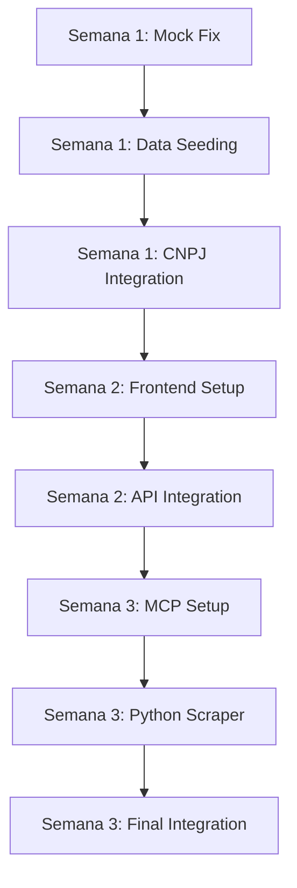

# 📋 ATIVIDADES MVP - DIVISÃO POR SEMANAS

**Visão Geral:** Breakdown detalhado das 3 semanas do MVP  
**Dependências:** Cada semana depende da anterior estar 100% concluída  
**Estimativa:** 5 dias úteis por semana, ~6-8 horas/dia  

---

## 🗓️ OVERVIEW TEMPORAL

```
SEMANA 1 (Dias 1-5)     SEMANA 2 (Dias 6-10)    SEMANA 3 (Dias 11-15)
├─ Base Operacional     ├─ Frontend Essencial    ├─ MCP + Python Scraper
├─ H2 + Mock Fix        ├─ React + TailwindCSS   ├─ Query Analysis IA
├─ Data Seeding         ├─ 4 Telas Principais    ├─ Strategy Decision
├─ CNPJ.ws Integration  ├─ API Integration       ├─ Web Scraping Real
└─ 3 Fontes Funcionais  └─ UX/UI Profissional    └─ Diferencial Competitivo

RESULTADO ESPERADO POR SEMANA:
✅ Sistema estável       ✅ Produto usável        ✅ Diferencial IA
```

---

## 🔨 SEMANA 1 - ATIVIDADES DETALHADAS

### **📅 DIA 1 (Segunda)**
**Foco:** Resolver erro PostgreSQL + Setup H2

#### **🏗️ Atividades Core (6h)**
| Atividade | Duração | Prioridade | Entregável |
|-----------|---------|------------|------------|
| **Fix Mock Configuration** | 2h | 🔴 CRÍTICA | App roda sem erros |
| **Configurar H2 Database** | 1.5h | 🔴 CRÍTICA | Database in-memory funcionando |
| **Testar Endpoints REST** | 1h | 🟠 ALTA | APIs respondem corretamente |
| **Documentar setup** | 0.5h | 🟡 MÉDIA | README atualizado |
| **Resolver dependências Maven** | 1h | 🟠 ALTA | Build limpo |

#### **✅ Checklist Fim do Dia 1**
- [ ] `./gradlew bootRun --args="--spring.profiles.active=mock"` roda sem erro
- [ ] H2 console acessível em `/h2-console`
- [ ] Zero erros no startup log
- [ ] 3 APIs principais respondem: `/companies`, `/icps`, `/leads/search`

---

### **📅 DIA 2 (Terça)**  
**Foco:** Continuar correções + iniciar data seeding

#### **🏗️ Atividades Core (7h)**
| Atividade | Duração | Prioridade | Entregável |
|-----------|---------|------------|------------|
| **Finalizar correções Mock** | 1h | 🔴 CRÍTICA | Sistema 100% estável |
| **Criar DataSeeder Service** | 3h | 🔴 CRÍTICA | Seeding automático no startup |
| **Popular 30 empresas Tech** | 1.5h | 🟠 ALTA | Empresas tech brasileiras |
| **Popular 20 empresas Agro** | 1h | 🟠 ALTA | Empresas agronegócio |
| **Configurar scores realistas** | 0.5h | 🟡 MÉDIA | Scores 45-95 distribuídos |

#### **✅ Checklist Fim do Dia 2**
- [ ] 50+ empresas criadas automaticamente
- [ ] Scores distribuídos realisticamente (45-95)  
- [ ] Dados brasileiros (SP, RJ, MG, PR, RS)
- [ ] Industries variadas (tech, agro, fintech, saúde)

---

### **📅 DIA 3 (Quarta)**
**Foco:** Completar data seeding + criar ICPs

#### **🏗️ Atividades Core (6.5h)**
| Atividade | Duração | Prioridade | Entregável |
|-----------|---------|------------|------------|
| **Completar 100+ empresas** | 2h | 🔴 CRÍTICA | Base de dados robusta |
| **Criar 3 ICPs de demo** | 2h | 🔴 CRÍTICA | ICPs Tech, Agro, Fintech |
| **Associar empresas aos ICPs** | 1h | 🟠 ALTA | Scoring baseado em ICP |
| **Testar busca com dados** | 1h | 🟠 ALTA | Search retorna resultados |
| **Otimizar performance** | 0.5h | 🟡 MÉDIA | <5s para búscas típicas |

#### **✅ Checklist Fim do Dia 3**
- [ ] 100+ empresas na base
- [ ] 3 ICPs funcionais (Tech, Agro, Fintech)
- [ ] Search por "tecnologia" retorna 15+ resultados
- [ ] Search por "agronegócio" retorna 10+ resultados

---

### **📅 DIA 4 (Quinta)**
**Foco:** Integração CNPJ.ws

#### **🏗️ Atividades Core (7h)**
| Atividade | Duração | Prioridade | Entregável |
|-----------|---------|------------|------------|
| **Implementar CNPJLeadDiscoverySource** | 3h | 🔴 CRÍTICA | Nova fonte de dados |
| **Configurar rate limiting** | 1h | 🟠 ALTA | Evitar bloqueio API |
| **Implementar graceful fallback** | 1.5h | 🟠 ALTA | Funciona mesmo se API falhar |
| **Testar integração CNPJ** | 1h | 🟠 ALTA | Dados reais do CNPJ.ws |
| **Documentar nova fonte** | 0.5h | 🟡 MÉDIA | Docs atualizados |

#### **✅ Checklist Fim do Dia 4**
- [ ] Source `cnpj-ws` disponível em allowed-sources
- [ ] Busca "empresas brasileiras" usa CNPJ.ws
- [ ] Graceful failure se API externa falhar
- [ ] Logs informativos sobre performance

---

### **📅 DIA 5 (Sexta)**
**Foco:** Polimento + preparação Semana 2

#### **🏗️ Atividades Core (6h)**
| Atividade | Duração | Prioridade | Entregável |
|-----------|---------|------------|------------|
| **Testing end-to-end** | 2h | 🔴 CRÍTICA | Todos os fluxos funcionando |
| **Performance tuning** | 1h | 🟠 ALTA | <5s para buscas |
| **Documentation** | 1h | 🟠 ALTA | Setup guide atualizado |
| **Backup/Export dados** | 1h | 🟡 MÉDIA | Dados preservados |
| **Setup environment frontend** | 1h | 🟡 MÉDIA | Node.js, npm prontos |

#### **✅ Checklist Final Semana 1**
- [ ] **Demo Ready:** 5min de demo funcional
- [ ] **3 Fontes:** in-memory + vector + cnpj-ws
- [ ] **Performance:** <5s para buscas típicas
- [ ] **Reliability:** App reinicia sem perder dados

---

## 🎨 SEMANA 2 - ATIVIDADES DETALHADAS

### **📅 DIA 6 (Segunda)**
**Foco:** Setup React + Scaffolding

#### **🏗️ Atividades Core (7h)**
| Atividade | Duração | Prioridade | Entregável |
|-----------|---------|------------|------------|
| **Criar projeto React + TypeScript** | 1h | 🔴 CRÍTICA | Projeto base funcionando |
| **Setup TailwindCSS** | 1h | 🔴 CRÍTICA | CSS framework configurado |
| **Configurar React Router** | 1h | 🟠 ALTA | Navegação entre páginas |
| **Setup React Query** | 1.5h | 🟠 ALTA | API state management |
| **Estrutura de pastas** | 1h | 🟠 ALTA | Organização escalável |
| **API service layer** | 1.5h | 🟠 ALTA | Integração com backend |

#### **✅ Checklist Fim do Dia 6**
- [ ] `npm run dev` roda sem erros
- [ ] TailwindCSS aplicando estilos
- [ ] React Router navegando entre rotas
- [ ] API service conectando com backend

---

### **📅 DIA 7 (Terça)**
**Foco:** Layout + Dashboard

#### **🏗️ Atividades Core (7.5h)**
| Atividade | Duração | Prioridade | Entregável |
|-----------|---------|------------|------------|
| **Header component** | 1.5h | 🔴 CRÍTICA | Header com navegação |
| **Sidebar navigation** | 1.5h | 🔴 CRÍTICA | Menu lateral responsivo |
| **Layout wrapper** | 1h | 🔴 CRÍTICA | Layout consistente |
| **Dashboard página** | 2h | 🟠 ALTA | Página inicial funcional |
| **Stats cards** | 1h | 🟠 ALTA | Métricas básicas |
| **Quick actions** | 0.5h | 🟡 MÉDIA | Botões de ação rápida |

#### **✅ Checklist Fim do Dia 7**
- [ ] Layout profissional funcionando
- [ ] Dashboard exibindo métricas
- [ ] Navegação entre páginas
- [ ] Design responsivo (mobile/desktop)

---

### **📅 DIA 8 (Quarta)**
**Foco:** Search Page + Formulários

#### **🏗️ Atividades Core (8h)**
| Atividade | Duração | Prioridade | Entregável |
|-----------|---------|------------|------------|
| **Search page layout** | 1h | 🔴 CRÍTICA | Página de busca |
| **Search form component** | 2h | 🔴 CRÍTICA | Formulário validado |
| **React Hook Form setup** | 1.5h | 🟠 ALTA | Forms performáticos |
| **Integração com API search** | 2h | 🔴 CRÍTICA | Busca funcionando |
| **Loading states** | 1h | 🟠 ALTA | UX durante loading |
| **Error handling** | 0.5h | 🟠 ALTA | Tratamento de erros |

#### **✅ Checklist Fim do Dia 8**
- [ ] Formulário de busca funcional
- [ ] Validação client-side
- [ ] Integração com backend search API
- [ ] Loading states implementados

---

### **📅 DIA 9 (Quinta)**
**Foco:** Results Table + ICP Management

#### **🏗️ Atividades Core (8h)**
| Atividade | Duração | Prioridade | Entregável |
|-----------|---------|------------|------------|
| **Search results table** | 2.5h | 🔴 CRÍTICA | Tabela de resultados |
| **Results filtering** | 1h | 🟠 ALTA | Filtros básicos |
| **ICP management page** | 2h | 🔴 CRÍTICA | CRUD de ICPs |
| **ICP forms + modais** | 2h | 🟠 ALTA | Criar/editar ICPs |
| **Delete confirmations** | 0.5h | 🟡 MÉDIA | UX para delete |

#### **✅ Checklist Fim do Dia 9**
- [ ] Tabela de resultados com dados
- [ ] ICP CRUD completo funcionando
- [ ] Modais e formulários validados
- [ ] React Query cache otimizado

---

### **📅 DIA 10 (Sexta)**
**Foco:** Companies + Polish

#### **🏗️ Atividades Core (7h)**
| Atividade | Duração | Prioridade | Entregável |
|-----------|---------|------------|------------|
| **Companies list page** | 1.5h | 🟠 ALTA | Lista de empresas |
| **Company detail modal** | 1.5h | 🟠 ALTA | Detalhes da empresa |
| **Error boundaries** | 1h | 🟠 ALTA | Error handling robusto |
| **Loading skeletons** | 1h | 🟡 MÉDIA | UX polish |
| **Performance optimization** | 1h | 🟡 MÉDIA | Bundle size + speed |
| **Production build test** | 1h | 🟠 ALTA | Build funcionando |

#### **✅ Checklist Final Semana 2**
- [ ] **4 Páginas:** Dashboard, Search, ICPs, Companies
- [ ] **CRUD Completo:** ICPs gerenciáveis
- [ ] **Search Integration:** Busca + resultados funcionais
- [ ] **Production Ready:** Build otimizado

---

## 🧠 SEMANA 3 - ATIVIDADES DETALHADAS

### **📅 DIA 11 (Segunda)**
**Foco:** MCP Setup + Configuration

#### **🏗️ Atividades Core (7.5h)**
| Atividade | Duração | Prioridade | Entregável |
|-----------|---------|------------|------------|
| **Setup OpenAI/Anthropic dependencies** | 1h | 🔴 CRÍTICA | Dependencies Maven |
| **Configurar API keys** | 0.5h | 🔴 CRÍTICA | Keys em properties |
| **Implementar MCPClient** | 2.5h | 🔴 CRÍTICA | Client HTTP funcionando |
| **Error handling + timeouts** | 1h | 🟠 ALTA | Resilience patterns |
| **Cost tracking setup** | 1.5h | 🟠 ALTA | Budget monitoring |
| **Testing API calls** | 1h | 🟠 ALTA | Validar integração |

#### **✅ Checklist Fim do Dia 11**
- [ ] MCP Client conectando com OpenAI/Claude
- [ ] API calls funcionando com timeouts
- [ ] Error handling para falhas de rede
- [ ] Cost tracking registrando usage

---

### **📅 DIA 12 (Terça)**
**Foco:** Query Analysis com IA

#### **🏗️ Atividades Core (8h)**
| Atividade | Duração | Prioridade | Entregável |
|-----------|---------|------------|------------|
| **Implementar MCPQueryAnalyzer** | 3h | 🔴 CRÍTICA | Análise de queries |
| **Prompts em português** | 1.5h | 🔴 CRÍTICA | Prompts otimizados |
| **Query Analysis DTOs** | 1h | 🟠 ALTA | Estruturas de dados |
| **Fallback regex-based** | 1.5h | 🟠 ALTA | Backup se MCP falhar |
| **Cache de análises** | 1h | 🟡 MÉDIA | Performance + cost |

#### **✅ Checklist Fim do Dia 12**
- [ ] Query "CTOs fintech SP" → analysis estruturado
- [ ] Confidence scoring funcionando
- [ ] Fallback para queries que IA não entende
- [ ] Cache evitando calls duplicadas

---

### **📅 DIA 13 (Quarta)**
**Foco:** Strategy Decision + Integration

#### **🏗️ Atividades Core (7.5h)**
| Atividade | Duração | Prioridade | Entregável |
|-----------|---------|------------|------------|
| **Implementar MCPStrategyDecider** | 2.5h | 🔴 CRÍTICA | Decisão automática |
| **Strategy decision logic** | 2h | 🔴 CRÍTICA | Lógica de estratégia |
| **Integration com Discovery Service** | 2h | 🔴 CRÍTICA | Enhanced discovery |
| **Parallel vs sequential execution** | 1h | 🟠 ALTA | Modes de execução |

#### **✅ Checklist Fim do Dia 13**
- [ ] Strategy automática baseada em análise
- [ ] Discovery Service usando MCP
- [ ] Execution modes funcionando
- [ ] Response includes analysis + strategy

---

### **📅 DIA 14 (Quinta)**
**Foco:** Python Scraper Service

#### **🏗️ Atividades Core (8.5h)**
| Atividade | Duração | Prioridade | Entregável |
|-----------|---------|------------|------------|
| **Setup Flask application** | 1.5h | 🔴 CRÍTICA | Service Python funcionando |
| **Implementar web scraping** | 3h | 🔴 CRÍTICA | Extração de dados |
| **Email/phone extraction** | 2h | 🟠 ALTA | Contatos extraídos |
| **Rate limiting + headers** | 1h | 🟠 ALTA | Evitar bloqueios |
| **Docker containerization** | 1h | 🟠 ALTA | Deploy fácil |

#### **✅ Checklist Fim do Dia 14**
- [ ] Flask service respondendo em localhost:3000
- [ ] Scraping extraindo emails reais
- [ ] Rate limiting funcionando
- [ ] Docker container buildando

---

### **📅 DIA 15 (Sexta)**
**Foco:** Integration + Final Polish

#### **🏗️ Atividades Core (8h)**
| Atividade | Duração | Prioridade | Entregável |
|-----------|---------|------------|------------|
| **Java ↔ Python integration** | 2.5h | 🔴 CRÍTICA | Comunicação funcionando |
| **ScraperLeadDiscoverySource** | 2h | 🔴 CRÍTICA | Fonte scraper integrada |
| **End-to-end testing** | 2h | 🔴 CRÍTICA | Fluxo completo testado |
| **Performance optimization** | 1h | 🟠 ALTA | Timeouts + retries |
| **Final demo preparation** | 0.5h | 🟡 MÉDIA | Demo script atualizado |

#### **✅ Checklist Final Semana 3**
- [ ] **Query Intelligence:** IA analisa em português
- [ ] **Smart Strategy:** Decide fontes automaticamente  
- [ ] **Web Scraping:** Extrai dados reais de sites
- [ ] **Integration:** Java + Python comunicando
- [ ] **Demo Ready:** Diferencial claro funcionando

---

## 📊 MATRIZ DE DEPENDÊNCIAS

### **🔗 Dependências Entre Atividades**



### **⚠️ Dependências Críticas**
| Semana | Dependência | Impacto se Falhar |
|--------|-------------|-------------------|
| 1 → 2 | Backend estável | Frontend não consegue integrar |
| 2 → 3 | API integration | MCP não consegue mostrar resultados |
| 1 → 3 | Data seeding | MCP não tem dados para demonstrar |

### **🔄 Atividades Paralelas Possíveis**
- **Semana 1:** Data seeding + CNPJ research (podem ser simultâneas)
- **Semana 2:** Frontend components + API service (podem ser paralelas)  
- **Semana 3:** MCP development + Python scraper setup (independentes)

---

## ⏱️ ESTIMATIVAS REALISTAS

### **📅 Por Semana**
| Semana | Horas Planejadas | Buffer | Total Realista |
|--------|------------------|--------|----------------|
| **Semana 1** | 32h | +8h | 40h (8h/dia) |
| **Semana 2** | 37h | +8h | 45h (9h/dia) |  
| **Semana 3** | 39h | +6h | 45h (9h/dia) |
| **TOTAL** | **108h** | **+22h** | **130h** |

### **🎯 Milestones Críticos**
- **Dia 5:** Sistema demo-ready (backend)
- **Dia 10:** Interface usável (frontend)  
- **Dia 15:** Diferencial competitivo (IA + scraper)

### **🚨 Red Flags**
- **Dia 2:** Se mock ainda não funciona → prioridade máxima
- **Dia 7:** Se frontend não integra → rever API contracts
- **Dia 13:** Se MCP não analisa → considerar fallback permanente

---

**🎉 Este breakdown garante que cada dia tem objetivos claros e cada semana constrói sobre a anterior, resultando em um produto demo-ready em 3 semanas!**

*"Dividir para conquistar - cada atividade é um passo rumo ao MVP funcional."*